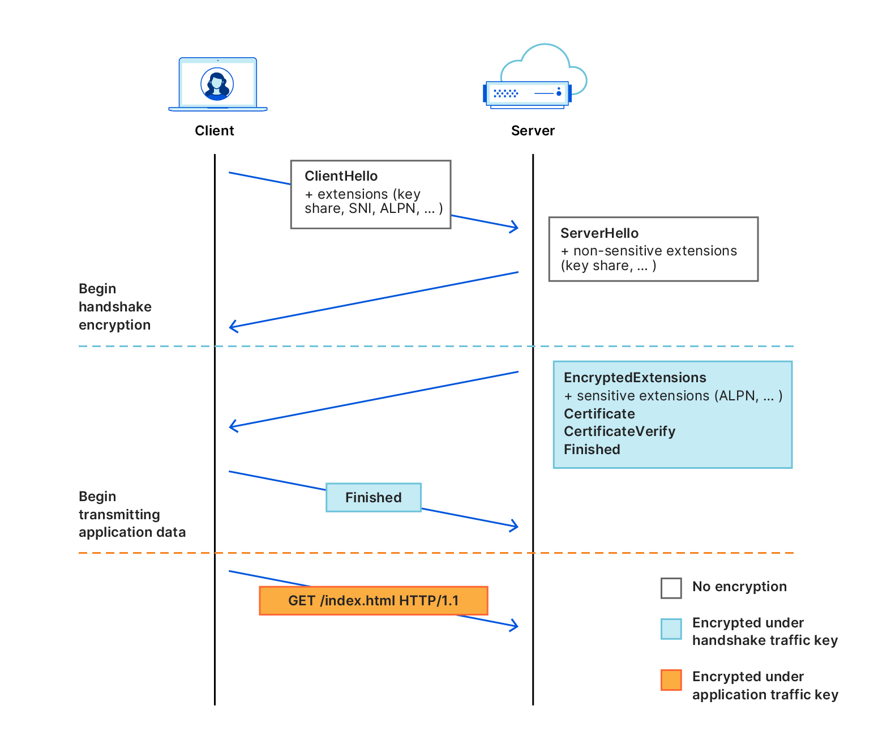

+++
title = 'Xray的REALITY如何突破白名单? 兼谈基于TLS的规避工具发展历程'
description = ''
date = 2024-07-31T00:00:00+08:00
draft = false
tags = ["反审查","SNI白名单","TLS","加密代理"]
categories = ["反审查","TLS"]
compact4Phone = true
betterList4Phone = true
+++

### ℹ️前言
[XTLS/Xray-core](https://github.com/XTLS/Xray-core/)，又称Project X，是一个开源的审查规避工具，在中文反审查领域中以其新颖前卫而实用的各种概念性技术 ~~还有曾经神秘失踪让人以为跑路了的项目创建者&维护者RPRX~~ 而闻名，这些技术有VLESS,XTLS-Vision,XUDP...总有一个你听说过或者用过的。

自从中国大陆的一些地区开始大范围部署一种全新的审查策略--**SNI白名单**，在REALITY和ShadowTLS出现以前的所有基于TLS的规避工具，不论是直接连接或是通过中转或CDN连接，一夜之间全都在这些地区变得不可用。

*(已知中国大陆福建省泉州市中国移动是大陆最早部署这一审查策略的运营商)*

先前ihciah开发的规避工具ShadowTLS得到广泛关注，我想这一项目或许是RPRX开发REALITY并将其集成到Xray-core中的灵感之一。ShadowTLS引起关注时，尚处于v1版本，代码库不完善，审查抗性弱；后来RPRX开发的REALITY由于同样具有**规避SNI白名单审查策略**的能力，以及其与成熟的规避工具[Xray-core](https://github.com/XTLS/Xray-core/)的高度集成，~~或许也有RPRX回归给用户们带来的惊喜~~，在中文反审查领域引起大量关注。

那么REALITY是如何规避这一审查策略的? 从技术角度如何理解其细节? 这两个问题将是本文接下来探讨的重点。同时，本文也将为读者梳理其他被广泛使用(过)的、基于TLS的规避工具的发展历程。

(小插曲: ShadowTLS有v1,v2,v3三个不相兼容的版本，其中v2修复了v1存在的主动探测漏洞，见论文 [Chasing Shadows: A security analysis of the ShadowTLS proxy](https://www.petsymposium.org/foci/2023/foci-2023-0002.pdf)；而v3的设计旨在对流行的TLS库实现之一 `Rustls` 作最小的必要修改，使得服务端有了正常响应TLS Alert(应对MITM流量篡改)的能力，相较v2更加隐蔽；当然这都是后话了，未来可能会出一期文章讲ShadowTLS，此处不再赘述)

### 👀 "SNI白名单"是什么? SNI和TLS是什么关系?
你可能知道，现在广泛使用的应用层安全协议，HTTPS的基石——TLS协议在发起连接时有自己的"握手流程"。什么? 你不知道"握手"是啥? 你可以看看我的往期文章 "[流量分类识别加密代理? 初探TLS in Any问题](/posts/what-is-tls-in-any/)" 中的[这一段](/posts/what-is-tls-in-any/?highlight=what-is-tls-handshake-hl)。

TLS自第一个版本设计之初就是"**混合加密系统**"。这意味着TLS既使用非对称加密算法，也使用对称加密算法。对称加密算法需要通信双方持有**完全相同**的密钥，加解密开销较小；而非对称加密只需要双方交换**各自持有的密钥对中的公钥**，但是非对称加密在交换公钥时需要验证公钥未被替换或篡改，因而催生了数字证书机制。并且非对称加解密开销较大。因此，TLS使用非对称加密传输用于对称加密的密钥，为了交换用于非对称加密的公钥，从而催生了TLS握手机制。

在理解**SNI白名单**这种审查策略之前，我们先来看看一个未使用ECH的常见TLS1.3连接的握手流程:

(这里引用一张来自[Cloudflare Blog](https://blog.cloudflare.com/encrypted-client-hello/)的图片，版权归[Cloudflare lnc.](https://www.cloudflare.com/)所有。)


首先是客户端发起TLS连接。在正确完成[TCP握手](https://zh.wikipedia.org/wiki/传输控制协议#建立通路)后，客户端生成一对密钥对，通过打开的TCP连接向服务器发送 TLS Client Hello 消息: 客户端的所有握手参数，包括各个扩展字段 *(extensions)* 以及key_share *(刚刚客户端生成的密钥对中的公钥)*。这些参数**无论敏感与否**，都在 TLS Client Hello 中发送。

其次，服务器使用 TLS Client Hello 中允许的密钥交换算法来生成一个密钥对，发送 TLS Server Hello: TLS1.3的 Server Hello消息不同于TLS1.2，它只包含了服务器的所有**不敏感的**握手参数，比如key_share *(刚刚服务器生成的密钥对中的公钥)*。

客户端在接收到了 TLS Server Hello 后，将其中的key_share *(刚刚服务器生成的密钥对中的公钥)*提取出来，与最初**客户端**生成的密钥对中的私钥一同输入Diffle-Hellman密钥交换函数中。
*(Diffle-Hellman密钥交换算法简称DH算法，DHE算法是通过轮换密钥实现前向安全性的DH变种，ECDHE算法是基于椭圆曲线的DHE变种。截至文章发布，最新版本的TLS1.3在处理公钥交换时仅支持ECDHE密钥交换算法。)*

DH及其衍生算法有一个共同的性质: 将两对适用算法要求的密钥对的公钥或私钥交换，再将交换后的两对密钥对分别输入算法，一定能得到**完全相同**的值。即: 生成适用于算法要求的密钥对A (含公钥pub_A和私钥sec_A) 和密钥对B (含公钥pub_B和私钥sec_B)，将 (pub_A, sec_B) 输入算法，得到的值一定与将 (pub_B, sec_A) 输入算法的得到的值**完全相同**。

在这里，客户端使用 来自服务器的公钥 和 自己的私钥 输入DH算法得到的值来生成密钥，生成的密钥一定与服务器使用 来自客户端的公钥 和 自己的私钥 计算得到的密钥相同。这里生成的密钥被称作 `preMasterKey`，仅用于加解密接下来的**握手**消息。

接下来，服务器使用 `preMasterKey` 加密**尚未发送的敏感的**握手参数，包括用于验证服务器身份的数字证书 *(因为数字证书包含了对应的域名/IP信息)*，将其封装为 TLS Application Data 消息，并附加在 Change Cipher Spec 后再发送给客户端。客户端在收到 Change Cipher Spec 后，使用 `preMasterKey` 解密附加在其后的 TLS Application Data，通过其中的数字证书验证服务器身份 *(即证明服务器持有特定域名/IP)*，提取握手参数，构造 TLS Finished 消息并使用 `preMasterKey` 加密后发往服务器，以表示TLS握手成功完成。同时，客户端将此前在 TLS Server Hello 和 Change Cipher Spec后的附加消息中提取的完整握手参数输入DH算法计算 `MasterKey`，用于加解密接下来的**所有**消息 *(即接下来的TLS Application Data 包)*。服务器在收到 TLS Finished 消息之后也以同样逻辑计算 `MasterKey`。

(在实际的TLS库实现中，客户端常常会将第一个包含应用数据的 TLS Application Data 在服务器应答 TLS Finished 前发送以减少延迟。上面的示意图中最后的"GET /index.html HTTP/1.1"即是指这种情况。)

其中，TLS握手开始时，客户端在 TLS Client Hello 消息中使用[SNI 扩展 (**S**erver **N**ame **I**ndicator)](https://datatracker.ietf.org/doc/html/rfc6066#section-3)来向服务器指示它想要访问的网站。这对于现代互联网来说至关重要，因为现在许多源服务器位于单个TLS服务器后面是很常见的，比如内容分发网络(CDN)。服务器使用 SNI 来确定谁将对连接进行身份验证：没有它，就无法知道要向客户端提供哪个网站的 TLS 证书。

审查者实施基于SNI的审查策略的关键在于，SNI对网络中的任何路由(流量传输时经过的端点)都是**可见明文**的，因此将泄露客户端想要连接的原始服务器。同时审查者通过控制所有的流量出口路由，并**限制允许通过的 TLS Client Hello 的SNI扩展的值**，以此来阻止不受审查者信任的TLS流量通过。我们称这种审查策略为"**SNI白名单**"。

Q: 为什么上面选择TLS1.3作例子而不是TLS1.3? 在这里为什么不启用TLS1.3的ECH特性?

A: 1. TLS1.3很大程度上就是TLS1.2简化后的版本，它修复了前代协议设计中的诸多安全漏洞、设计得更加简洁好用，并且自第一个正式版本在2018年发布以来，其部署规模正在不断扩大。其次，[XTLS](https://github.com/XTLS)实现下的REALITY服务端不支持合法客户端使用除TLS1.3以外的TLS版本连接。

2. 截至文章发布，[XTLS](https://github.com/XTLS)实现下的REALITY默认并不启用TLS1.3的ECH特性。~~额，其实配置文件里根本没有相关选项~~。而且REALITY设计的核心就是向审查者(中间人)"表演"使用**被允许的SNI的扩展的值**的合法TLS握手，并通过由该握手打开的TLS通道传输规避流量。

### 🤔 我们来想想如何改变SNI

1. 在规避工具的客户端向服务端发起TLS握手时，直接修改 TLS Client Hello 的SNI扩展的值。

   这种方法来得简单粗暴，但是很显然，它不具有良好的审查抗性并且会破坏TLS的认证机制。TLS握手时用于验证服务端身份的数字证书需要由受客户端信任的上级CA *(证书权威机构)*使用私钥进行签名，包括**证书附属信息以及其中的域名信息**，因此在没有由上级CA对修改后的证书进行签名的情况下，不可能修改来自其他网站的有效的证书同时保持其有效性。实际上，这种情况下**即使是该证书的所有者**也无法修改他所持有的有效数字证书同时保持其有效性。

   而 TLS Client Hello 的SNI扩展的值，**必须**与来自服务器的TLS Server Hello中的有效数字证书的扩展信息中的**域名**相符合。*(不一定完全相同，用于TLS服务器身份验证的数字证书中有一类"泛域名证书"，这类证书能够验证某域名下的所有子域名的身份而无需为子域名逐个签发证书。)* 

   同理，审查者可以记录经过的TLS流量中 TLS Client Hello 的SNI扩展的值，使用该值构造 TLS Client Hello，并将其发往对应服务器，检查返回的 TLS Server Hello 中数字证书的有效性，以及证书扩展信息中的域名是否与原SNI值相符合，若任何一项不符合，即可认为该流量为规避流量。

2. 从1.中我们了解到，如果要修改 TLS Client Hello 的SNI，或许需要连带修改数字证书。

   当然，这只是开个玩笑，数字签名的数学属性决定了当前算力条件下它不可能被篡改同时保持其有效性。

   诶，等等...我们在上一节中是不是提到了什么? 再看看那幅示意图...TLS1.3握手中的服务器的数字证书是在加密后被发送的，对吧? 因此，在1.中审查者**无法被动观察和收集到**到用户发起的TLS1.3握手中的数字证书，审查者**必须**使用原SNI的值构造 TLS Client Hello 以获得先前的数字证书，从而实现审查目的。虽然数字证书不能被篡改，但是如果我们能够**区分**规避客户端和审查者，是否可以向他们分别提供**不同的**数字证书呢?

###  🔍 试试潜入REALITY的代码海洋?
在上一节中我们提出了"通过区分TLS客户端类型从而提供不同数字证书"的规避策略，这便是REALITY的设计关键之一。但是如何区分呢? 如何协商用于加密握手的密钥 `preMasterKey` 呢? 这一节我们试试深入REALITY的源代码，结合第一节的知识，抽丝剥茧地解析REALITY实现这一规避策略的技术细节。

**请先别走**! 不论你是编程新手、还是开发小白，这一节都尽可能以**易懂的自然语言**，向你仔细地解释这一节出现的所有源代码的作用。请始终记住: **看懂程序是看懂设计思路，不是看懂编程语言知识**。

这里出现的所有服务端源代码，以Github代码库 [XTLS/REALITY](https://github.com/XTLS/REALITY) 中 `main` 分支的 `079d0bd` commit版本为准；
这里出现的所有客户端源代码，以Github代码库 [XTLS/Xray-core](https://github.com/XTLS/Xray-core/) 中 `main` 分支的 `4c9e4b9` commit版本为准。

由于Xray-core的设计是由客户端发起代理连接，所以这里先从客户端的`reality`包<sup>1</sup>开始：
*(<sup>1</sup>包, package, 组织程序功能的一种单位，Go中同一目录 (不含子目录)下只能存在一个包)*

Xray-core中负责封装和传输代理流量的各个包都放在`transport/internet`目录下，`reality`包也不例外:

``````plaintext
xray-core/
|-- transport/
| |-- internet/
| | |-- reality/
| | | |-- config.go
| | | |-- config.pb.go
| | | |-- config.proto
| | | |-- reality.go
``````

该目录下config.proto, config.pb.go, config.go三个文件分别起 定义传入该包的protobuf3字段格式、定义用于存储配置的 struct<sup>2</sup> `reality.Config` 的公开方法<sup>3,4</sup>、将 `reality.Config` 的公开字段<sup>5</sup>填充完整 的主要作用。`reality.Config` 主要存储用于REALITY的配置。
*(<sup>2</sup> struct,结构体,Go中组织数据的一种单位,广义上的对象; <sup>3</sup>方法, 指与特定struct绑定的用于读写/处理该struct所有字段的函数; <sup>4</sup>公开方法,指可以被其它包调用的方法; <sup>5</sup>公开字段,指可以被其它包访问和修改的字段)*


发起REALITY连接的关键在 `reality.go`，其中 func<sup>6</sup> `UClient` 在其他包发起REALITY连接时被调用，是该包的客户端部分最主要的功能性入口:

```Go
// Xray-core/transport/internet/reality/reality.go#L106
func UClient(c net.Conn, config *Config, ctx context.Context, dest net.Destination) (net.Conn, error)
```
*(<sup>6</sup> func, 函数, 实现特定细分功能的一种单位)*

如上所示，func UClient接受来自net包的可读写的网络流接口 c, 存储REALITY配置的 config, 用于超时控制的通知管道 ctx, 指示目的地的结构体 dest。

func UClient的关键功能之一在于初始化了本包定义的 struct `UConn`:

```Go
// Xray-core/transport/internet/reality/reality.go#L64-L69
// UConn的字段定义
type UConn struct {
	*utls.UConn
	ServerName string
	AuthKey    []byte
	Verified   bool
}

// Xray-core/transport/internet/reality/reality.go#L108-L115
// uConn赋值为UConn实例, utlsConfig赋值为utls.Config实例(utls包配置)
uConn := &UConn{}
utlsConfig := &utls.Config{
	VerifyPeerCertificate:  uConn.VerifyPeerCertificate,
	ServerName:             config.ServerName,
	InsecureSkipVerify:     true,
	SessionTicketsDisabled: true,
	KeyLogWriter:           KeyLogWriterFromConfig(config),
}

// Xray-core/transport/internet/reality/reality.go#L124
// 初始化utls.UClient并赋值给uConn的第一个字段
uConn.UConn = utls.UClient(c, utlsConfig, *fingerprint)
```

UConn的第一个字段为匿名字段<sup>7</sup>，类型为来自[utls](https://github.com/refraction-networking/utls)<sup>8</sup>包的UConn实例的指针。这段代码就 Servername(SNI)、TLS Client Hello指纹识别对抗、**用于验证服务器证书有效性和服务器身份的func `VerifyPeerCertificate`** 等参数，对接下来用于发起和处理TLS握手的uConn进行了配置和初始化。
*(<sup>7</sup>匿名字段，即默认其名称为对应类型名称的字段; <sup>8</sup> utls, go标准库"crypto/tls"的变种, 为反审查用途提供TLS Client Hello指纹识别对抗、对于TLS握手的完全访问，Fake Session Ticket等功能)*

接下来到了关键的地方: REALITY客户端利用 TLS Client Hello 中的 **Session ID 字段空间**为客户端作隐蔽标记，以供服务器区分审查者与合法客户端。Session ID字段原本用于TLS1.3的0-RTT会话恢复特性，然而由于该特性会使第一个数据包失去抗重放特性，因此很少被启用。不启用0-RTT会话恢复特性时，每一个TLS1.3连接使用的Session ID都应当是**随机生成**的。

*(Xray-core中还专门为接下来这一段客户端代码划定了块级作用域。)*

```Go
// Xray-core/transport/internet/reality/reality.go#L126
// 生成默认ClientHello并提供给uConn
// 在这一步也生成了客户端的TLS密钥对
uConn.BuildHandshakeState()
// 将生成的默认ClientHello的指针赋值给hello
// (将指针赋值给hello意味着修改hello就是修改原数据)
hello := uConn.HandshakeState.Hello
// 将32字节长的空切片(动态数组)赋值给SessionId
// 并填充到ClientHello的第40-72字节，占个位
hello.SessionId = make([]byte, 32)
copy(hello.Raw[39:], hello.SessionId)
// 将Xray-core的版本号x.y.z填入SessionId第1-3字节
hello.SessionId[0] = core.Version_x
hello.SessionId[1] = core.Version_y
hello.SessionId[2] = core.Version_z
hello.SessionId[3] = 0 // 填充0到第4字节
// 将当前Unix时间戳填充到SessionId第5-8字节
binary.BigEndian.PutUint32(hello.SessionId[4:], uint32(time.Now().Unix()))
// 从SessionId第9字节开始将shortId填充进去
copy(hello.SessionId[8:], config.ShortId)

// Xray-core/transport/internet/reality/reality.go#L139
// 将REALITY公钥转换为可用的公钥对象
publicKey, err := ecdh.X25519().NewPublicKey(config.PublicKey)

// Xray-core/transport/internet/reality/reality.go#L143
// 使用BuildHandshakeState()生成的客户端TLS密钥对中的公钥，
// 与REALITY公钥输入ECDH算法计算共享密钥。然后再使用该密钥
// 输入HKDF(基于HMAC的密钥导出函数)计算preMasterKey用于加解密握手。
uConn.AuthKey, _ = uConn.HandshakeState.State13.EcdheKey.ECDH(publicKey)
// Xray-core/transport/internet/reality/reality.go#L147-L149
if _, err := hkdf.New(sha256.New, uConn.AuthKey, hello.Random[:20], []byte("REALITY")).Read(uConn.AuthKey); err != nil {
			return nil, err
}

// Xray-core/transport/internet/reality/reality.go#L160
// 使用AEAD算法加密SessionId。该算法保证了密文数据的安全性、
// 完整性以及抗重放性，同时为附加数据提供了完整性保证。
// 这里使用preMasterKey作密钥，使用ClientHello作附加数据。
aead.Seal(hello.SessionId[:0], hello.Random[20:], hello.SessionId[:16], hello.Raw)

// 将处理完成的SessionId数据填充到ClientHello第40-72字节
copy(hello.Raw[39:], hello.SessionId)
```

自此，REALITY客户端完成了对自身的隐蔽标记。接下来客户端向REALITY服务器发起TLS连接:

```Go
if err := uConn.HandshakeContext(ctx); err != nil {
	return nil, err
}
```

来到REALITY服务器的[源代码](https://github.com/XTLS/REALITY/)，它实际上是[go/tls](https://pkg.go.dev/crypto/tls)包(go 1.20)服务器部分的变种。由于REALITY服务器以最小修改原则对[go/tls](https://pkg.go.dev/crypto/tls)包作修改，因此目录中存在较多与REALITY协议不直接相关的文件，在此不列出目录树。

REALITY服务器处理TLS握手的关键是 `tls.go` 中的func Server。其实在仔细阅读过Xray-core中的客户端源代码过后，我们已经能对服务器区分合法客户端的关键逻辑有一个大概认识了。那么服务器如何处理非法客户端(审查者)发起的握手呢?

这是我们接下来探究的一个重点。鉴于读者在经过前面探究客户端源代码逻辑的过程后，已对区分合法客户端的关键逻辑有大概认识，接下来的源代码注释将比较简洁，望读者见谅。

```Go
// REALITY/blob/main/tls.go#L113
// 这里是函数定义，其中conn为服务器接受的TCP连接
func Server(ctx context.Context, conn net.Conn, config *Config) (*Conn, error)

// REALITY/blob/main/tls.go#L119
// 向REALITY配置中的dest(俗称伪装服务器)打开TCP连接
target, err := config.DialContext(ctx, config.Type, config.Dest)

// REALITY/blob/main/tls.go#L141-L151
// 初始化handshake_server_tls13.go中定义的
// serverHandshakeStateTLS13实例以存储握手信息
hs := serverHandshakeStateTLS13{
		c: &Conn{
			conn: &MirrorConn{
				Mutex:  mutex,
				Conn:   conn,
				Target: target,
			},
			config: config,
		},
		ctx: context.Background(),
	}


```
### 基于TLS规避审查这条路上，发生过什么

*(推荐相关阅读 : )*
1. [A Detailed Look at RFC 8446 (a.k.a. TLS 1.3) - Cloudflare Blog](https://blog.cloudflare.com/rfc-8446-aka-tls-1-3/)
1. [Good-bye ESNI, hello ECH! - Cloudflare Blog](https://blog.cloudflare.com/encrypted-client-hello/)